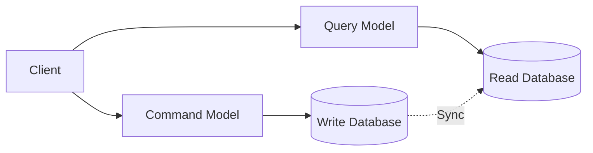

### CQS (Command Query Separation)

**기본 원칙**

- **Bertrand Meyer**가 제안한 객체지향 설계 원칙
- **Command**: 상태를 변경하는 작업 (반환값 없음)
- **Query**: 상태를 조회하는 작업 (부작용 없음)
- **"묻거나 시키거나, 둘 다는 안된다"**

메서드 분리

- 조회에서 상태 변경을 지양하고
- 상태 변경에서 반환 값 리턴을 지양한다.

### CQRS (Command Query Responsibility Segregation)

**CQS의 확장**

- **CQS**: 메서드 레벨 분리
- **CQRS**: **모델과 저장소 레벨 분리**
- 읽기와 쓰기를 완전히 다른 모델로 처리

**기본 구조**

### CQRS 구현 방식
**1. Simple CQRS (같은 DB)** 
- **동일한 데이터베이스, 다른 모델** 
- Write Model: 비즈니스 로직 중심
- Read Model: 쿼리 최적화 중심

**2. CQRS with Separate Stores**
- **완전히 분리된 저장소**
- Write DB: 정규화된 관계형 DB
- Read DB: 비정규화된 NoSQL, 검색엔진 등

**3. Event-driven CQRS**
- **Event Sourcing + CQRS**
- Command → Event Store
- Event → Read Model 업데이트

----

1. Command Side (쓰기)
**Command 구조** 
- **Command Handler**
	- **단일 책임**: 하나의 Command만 처리
	- **비즈니스 로직 수행**: 도메인 규칙 검증 
	- **이벤트 발행**: 상태 변경 후 도메인 이벤트 
 
2. Query Side (읽기) 
**Read Model 특화** 
- **Query Handler** 
	- **단순 조회**: 복잡한 로직 없이 데이터 반환 
	- **성능 최적화**: 인덱스, 캐시 활용 
	- **다양한 저장소**: SQL, NoSQL, 검색엔진 혼용 

3. 동기화 전략 
**Eventually Consistent** 
- **비동기 동기화**: Command 처리 후 Read Model 업데이트 
- **지연 허용**: 읽기 데이터가 약간 늦을 수 있음 
- **이벤트 기반**: Domain Event로 Read Model 갱신 **Synchronous Updates** 
- **즉시 동기화**: Command 처리와 동시에 Read Model 업데이트
- **트랜잭션 범위**: 쓰기와 읽기 모델을 같은 트랜잭션에 
- **성능 Trade-off**: 일관성 vs 응답시간

4. CQRS 복잡성 단계
	1. 메소드 분리
	2. 모델 분리
	3. 저장소 분리

5. Read Model 설계 패턴

**View per Use Case**
- **사용 사례별 전용 뷰**: 각 화면/API별 최적화
- **UserListView**: 목록 조회용
- **UserDetailView**: 상세 조회용
- **UserSearchView**: 검색 최적화용

**Materialized Views**
- **사전 계산된 집계**: 복잡한 계산 미리 저장
- **실시간 업데이트**: 이벤트 발생 시 즉시 갱신
- **성능 우선**: 저장 공간보다 응답 속도 중시

**주의사항**
- **복잡성 증가**: 두 개 모델 관리 부담
- **일관성 지연**: Eventually Consistent 허용 여부
- **데이터 동기화**: 실패 시 데이터 불일치
- **개발 비용**: 초기 구축 비용 높음