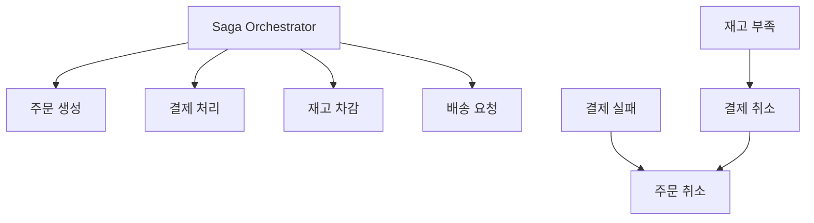
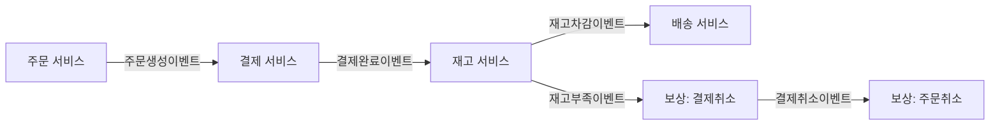
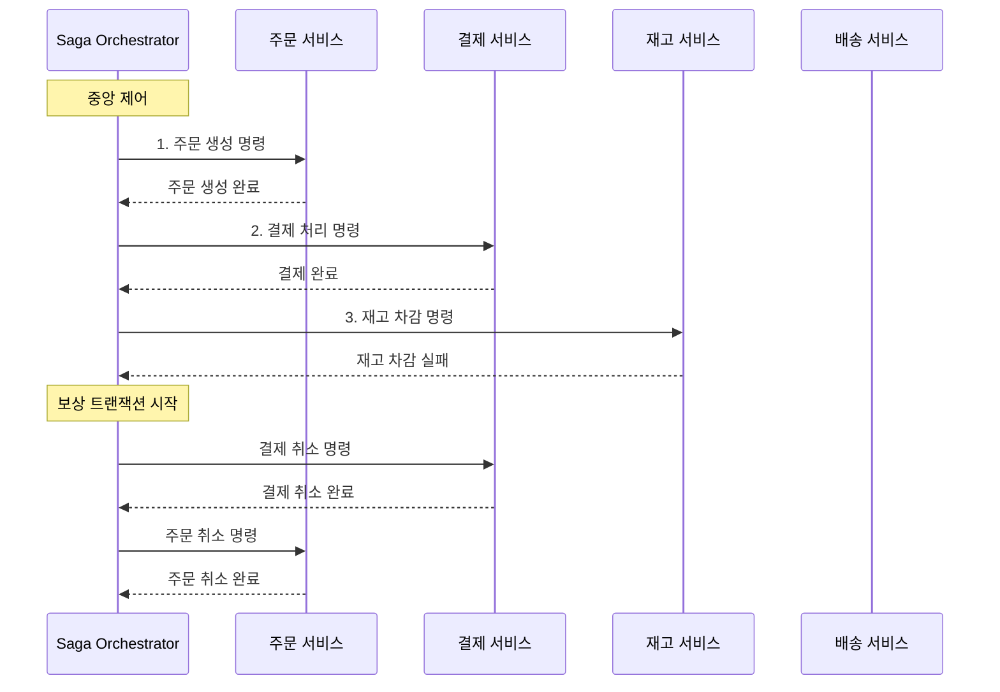
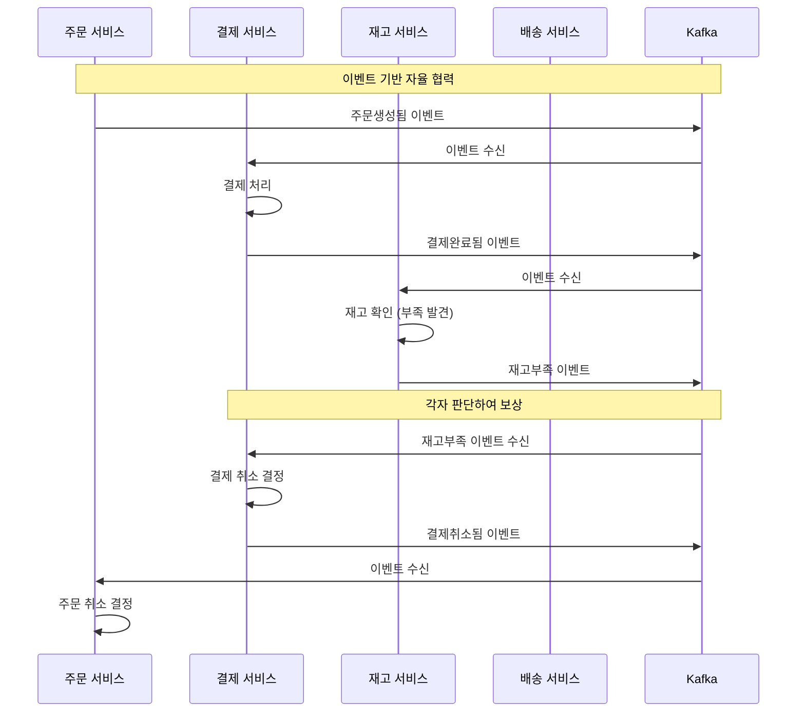

### Saga란?

**분산 트랜잭션 관리 패턴**
- **Long-running Transaction**: 오래 실행되는 비즈니스 프로세스
- **로컬 트랜잭션 체인**: 여러 서비스의 로컬 트랜잭션을 순차 실행
- **보상 트랜잭션**: 실패 시 이전 단계들을 되돌리는 메커니즘

**2PC와의 차이점**
- **2PC**: 모든 참여자가 동시에 커밋/롤백 (Synchronous)
- **Saga**: 각 단계를 순차적으로 실행하고 실패 시 보상 (Asynchronous)

### Saga 실행 방식

**Orchestration 방식**

Choreography 방식

---

### 1. Orchestration vs Choreography

**Orchestration (중앙 제어)**
- **어원**: 오케스트라 지휘자가 모든 연주자를 지휘하는 것
- **정의**: 중앙의 Orchestrator가 모든 서비스 호출을 제어하고 순서 관리
- **특징**: 
	- Command & Control 방식
	- **중앙 집중**: 모든 비즈니스 로직이 Orchestrator에 집중
	- **명령형**: "이것을 해라" 방식의 직접적 지시
	- **동기적 통신**: 각 단계 완료를 기다림
	- **단일 진실 공급원**: 전체 상태를 한 곳에서 관리
- **장점**: 전체 흐름 파악 쉬움, 중앙 집중 제어
- **단점**: Orchestrator가 SPOF, 서비스 간 결합도 증가
- **적용**: 복잡한 비즈니스 로직, 순서가 중요한 경우

**Choreography (분산 제어)**
- **어원**: 발레나 댄스의 안무. 각 댄서가 자신의 역할을 알고 자율적 수행
- **정의**: 각 서비스가 이벤트를 발행하고 구독하여 자율적으로 다음 단계 실행
- **특징**: 
	- Event-Driven 방식
	- **분산 제어**: 각 서비스가 자신의 역할 자율 결정
	- **이벤트형**: "이런 일이 일어났다" 방식의 알림
	- **비동기적 통신**: 이벤트 발행 후 즉시 다음 작업
	- **로컬 자율성**: 각 서비스가 자신의 비즈니스 로직 보유
- **장점**: 서비스 자율성, 확장성 좋음, 결합도 낮음
- **단점**: 전체 흐름 추적 어려움, 디버깅 복잡
- **적용**: 단순한 흐름, 서비스 독립성 중요한 경우

| 구분 | Orchestration | Choreography |
|------|---------------|--------------|
| **의사결정 방식** | 중앙에서 "다음에 뭘 할지" 결정 | 각 서비스가 "이벤트 받으면 뭘 할지" 결정 |
| **통신 패턴** | Request-Response (동기) | Publish-Subscribe (비동기) |
| **결합도** | 서비스들이 Orchestrator에 의존 (높은 결합도) | 서비스들이 이벤트 스키마에만 의존 (낮은 결합도) |
| **가시성** | 전체 플로우가 한 곳에서 명확히 보임 | 전체 플로우가 여러 서비스에 분산되어 추적 어려움 |
| **확장성** | 새 단계 추가 시 중앙 코드 수정 필요 | 새 서비스가 이벤트 구독만 하면 됨 |
| **장애 처리** | 중앙에서 보상 로직 관리 (단순) | 각 서비스가 보상 이벤트 발행 (복잡) |
| **적합한 상황** | • 비즈니스 프로세스가 복잡하고 순서가 중요 • 전체 흐름을 한눈에 파악해야 함 • 규제가 엄격한 금융, 의료 도메인 • 팀 규모가 작고 통제된 환경 | • 서비스 자율성이 중요 • 확장성과 유연성 우선 • 도메인별 팀이 독립적으로 운영 • 이벤트 드리븐 아키텍처 문화 |

### 2. 보상 트랜잭션 설계

**Compensating Action 원칙**
- **의미적 롤백**: 비즈니스적으로 의미 있는 되돌리기
- **멱등성**: 여러 번 실행해도 결과 동일
- **보상 불가능한 작업**: 이메일 발송, 외부 API 호출 등

**보상 순서**
- **역순 실행**: 마지막 성공 단계부터 첫 번째까지 거꾸로
- **병렬 보상**: 독립적인 단계들은 동시 보상 가능
- **피벗 트랜잭션**: 이후 보상 불가능한 지점 설정

### 3. 상태 관리

**Saga 상태 추적**
- **진행 상황**: 현재 어느 단계까지 완료됐는지
- **실패 지점**: 어느 단계에서 실패했는지
- **보상 상태**: 어느 보상 작업까지 완료됐는지

**상태 저장소**
- **Database Table**: Saga 상태를 DB에 저장
- **Event Store**: 모든 이벤트를 순서대로 저장
- **In-Memory**: Redis 등 빠른 접근 가능한 저장소

### 4. 일관성 모델

**ACD without I**
- **Atomicity**: 전체 성공 또는 전체 보상
- **Consistency**: 비즈니스 규칙 유지
- **Durability**: 결과 영구 저장
- **Isolation 없음**: 중간 상태가 다른 트랜잭션에 보임

**Eventual Consistency**
- **최종 일관성**: 시간이 지나면 모든 서비스가 일관된 상태
- **중간 불일치**: Saga 실행 중 일시적 데이터 불일치 허용
- **Read Your Writes**: 자신이 쓴 데이터는 즉시 읽기 가능

### 5. 장애 처리

**Timeout 처리**
- **단계별 타임아웃**: 각 서비스 호출에 제한 시간
- **전체 타임아웃**: Saga 전체 실행 시간 제한
- **Retry vs Compensate**: 재시도할지 보상할지 결정

**부분 실패 대응**
- **Forward Recovery**: 실패한 단계 재시도
- **Backward Recovery**: 보상 트랜잭션으로 롤백
- **Human Intervention**: 자동 복구 불가 시 수동 개입

### 6. 모니터링과 관찰성

**Saga 추적**
- **Correlation ID**: 전체 Saga를 관통하는 고유 식별자
- **분산 트레이싱**: 각 단계별 실행 시간과 상태
- **이벤트 로깅**: 모든 단계와 보상 작업 기록

**성능 메트릭**
- **완료율**: 성공적으로 완료된 Saga 비율
- **평균 실행 시간**: Saga 완료까지 소요 시간
- **보상 빈도**: 보상 트랜잭션 실행 빈도