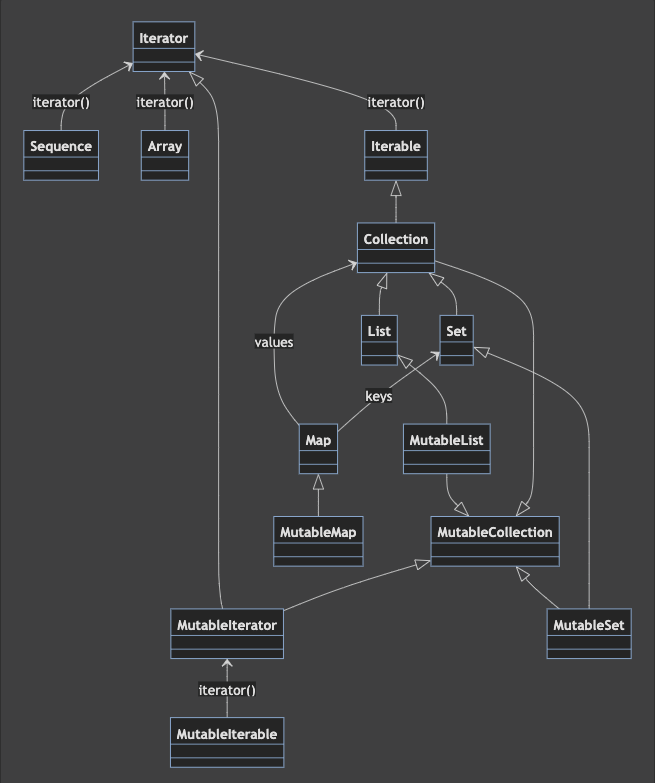

# Collection

- 컬렉션을 조작하는 모든 연산은 `inline 함수`다.


## 컬렉션 타입
- 타입은 기본적으로 `Array`, `Iterable`, `Sequence`, `Map`이 있다.



## iterable
- 일반적으로 `Iterable<T>`으로 표현되며, 일반적으로 즉시 계산되는 상태가 있는 컬렉션을 포함한다.
- `hasNext()`, `next()`가 있다. `remove()`가 빠졌다.
- java와 kotlin의 차이점은 불변/ 가변을 나눈다는 것이다.


## collection, list, set

### List
1. ArrayList
2. LinkedList

### set
1. LinkedHashSet
2. TreeSet

## sequence
- sequence 구현은 내부적이므로 외부에서 직접 사용할 수 없다. 대신 특별한 함수를 통해 시퀀스를 만들어야 한다.
- java의 stream과 비슷하다. 

## map
- key-value 쌍으로 이뤄진 집합


## 컬렉션 생성하기
- emptyList()/emptySet()
- listOf()/setOf()
- listOfNotNull()
- mutableListOf()/ mutableSetOf()
- arrayListOf()
- hashSetOf()/ linkedSetOf()/ sortedSetOf()
### 시퀀스 얻기
- `asSequence()`/ `generateSequence()`
```kotlin
mapOf(1 to "one", 2 to "Two").asSequence().iterator().next()
generateSequence(10) { it * it }
```

- kotlin 1.3부터 특별한 빌더로 사용해서 시퀀스를 만들 수 있다.
- builder는 시퀀스 원소르 부분부분 지정한다. `SequenceScope`가 수신 객체 타입인 확장 람다를 받는 `sequence()` 함수를 통해 빌더를 구현 할 수 있다.
  1. yield(): 원소를 하나 시퀀스에 추가
  2. yieldAll(): 지정한 iterable, iterable, sequence에 있는 모든 원소를 시퀀스에 추가한다.


## 컬렉션에 대한 조건 검사
- `all()` 함수는 모든 원소가 주어진 술어를 만족하면 true
- `none()` `all()`의 반대
- `any()`는 일부만 만족하면 된다.

## 집계
- `count()`
- `sum()`
- `sumOf{}`
- `average()` 
- `minOrNull()`
- `maxOrNull()`
- `minByOrNull{}`
- `maxByOrNull{}`
- `minWithOrNull()`
- `maxWithOrNull()`
- `joinToString()`
- `reduce()`
- `reduceIndexed()`
- `folder()`
- `folderIndexed()`


## 집계