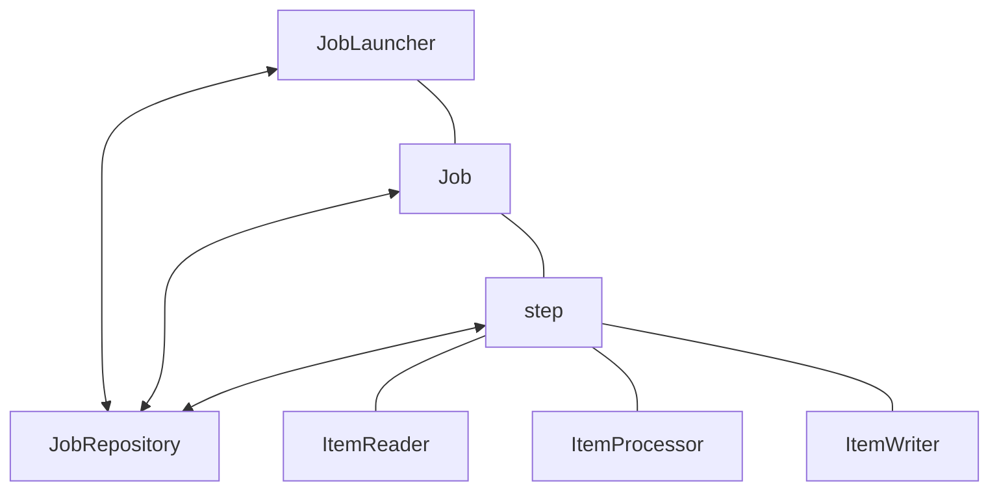
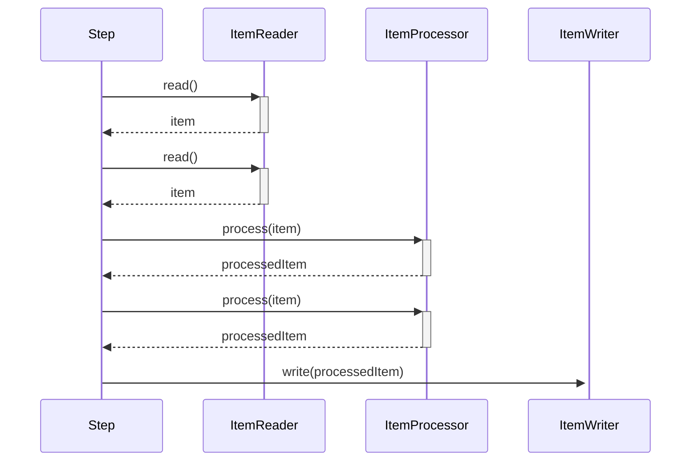
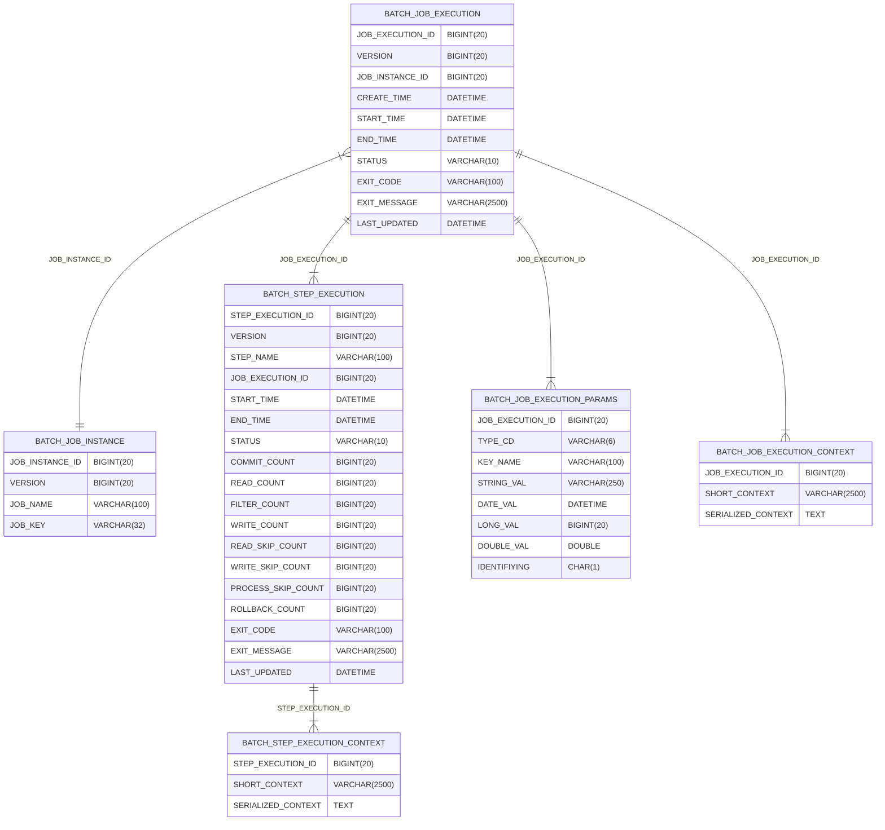

# SpringBatch


- JobLauncher : Job을 실행 시키는 컴포넌트
- JobRepository: Job실행, Job, Step을 저장
- Job : 하나의 배치 실행 단위, 1개 이상의 Step으로 구성됨
- JobInstance :논리적인 Job 실행을 의미합니다. 주로 Job 에 파라미터를 부여하여 다른 JobInstance 구분할수 있습니다.
- Step : 일련의 작업들
- ItemReader : Step에서 데이터를 읽는 Tasklet
- ItemProcessor: ItemReader에서 읽은 데이터를 처리하는 Tasklet
- ItemWriter : ItemProcessor로 처리된 데이터를 쓰는 Tasklet



## @JobScope와 @StepScope
> ### Scope란?
> - 스프링 컨테이너에서 빈이 관리되는 범위
> - singleton, prototype, request, session, application이 있으며 기본은 singleton으로 생성된다.

- Job과 Step의 빈 생성과 실행에 관여하는 스코프
- 프록시 모드를 기본 값으로 하는 스코프: `@Scope(value = "job", proxyMode = ScopedProxyMode.TARGET_CLASS)`
- `@JobScope`나 `@StepScope`가 선언되면 빈의 생성이 애플리케이션 구동 시점이 아닌 빈의 실행 시점에 이루어진다.
- `@Values`를 주입해서 빈의 실행 시점에 값을 참조할 수 있으며 일종의 Lazy Binding이 가능해진다.
- `@Value(”#{jobParameters[파라미터명]}”)`, `@Value(”#{jobExecutionContext[파라미터명]”})`, `@Value(”#{stepExecutionContext[파라미터명]”})`
- `@Value`를 사용할 경우 빈 선언문에 `@JobScope`, `@StepScope`를 정의하지 않으면 오류를 발생한다. 때문에 반드시 선언해야 한다.
- 프록시 모드로 빈이 선언되기 때문에 애플리케이션 구동 시점에는 빈의 프록시 객체가 생성되어 실행 시점에 실제 빈을 호출 해준다.
- 병렬 처리 시 각 쓰레드마다 생성된 스코프 빈이 할당 되기 때문에 쓰레드에 안전하게 실행이 가능하다.


```java

@Configuration
@Slf4j
@RequiredArgsConstructor
public class BatchExample {
    private final PlatformTransactionManager txManager;


    @Bean(name = "exampleJob")
    public Job exampleJob(@Qualifier(value = "exampleStep") Step step, JobRepository jobRepository) {
        return new JobBuilder("exampleJob", jobRepository).start(step).build();
    }


    @JobScope
    @Bean(name = "exampleStep") //작업으로 STep 명시
    public Step exampleStep(@Qualifier(value = "exampleTasklet") Tasklet tasklet, JobRepository jobRepository) {
        return new StepBuilder("exampleStep", jobRepository).tasklet(tasklet, txManager).build();
    }


    @StepScope
    @Bean(name = "exampleTasklet")
    public Tasklet exampleTasklet (){  // 간단한 작업 명세
        return (contribution, chunkContext) -> {
            log.info("ExampleTasklet");
            return RepeatStatus.CONTINUABLE;
        };
    }
}
```
## Spring Batch 5
1. `@EnableBatchProcessing`로 Batch를 initialize 할 수 없어졌음 -> 5부터 `autoConfigure` 날아감
2. `JobBuilderFactory` / `StepBuilderFactory` -> `JobBuilder`/ `StepBuilder`로 변경됨


[참고](https://tonylim.tistory.com/431) 


## Spring Batch Meta Table



### BATCH_JOB_INSTANCE
실행한 batchJob의 인스턴스에 대한 정보를 저장한다. batchJob은 해당 테이블의 레코드를 통해서 실행되며, 동일한 parameter로 실행된 batchJob의 경우 새로운 레코드가 생성되지 않는다.
- JOB_INSTANCE_ID : jobInstance의 getId
- VERSION : 레코드에 Update될 때마다 1씩 증가한다.
- JOB_NAME : JobBuilderFactory에서 Job을 빌드할 당시 get으로 Job의 이름을 부여하는데 그 값이다.
- JOB_KEY : 동일한 Job이름의 JobInstance는 Job 실행 시점에 부여되는 고유한 JobParamter의 값을 통해서 식별된다. 그리고 이 식별되는 값의 직렬화된 결과를 이 컬럼에 기록한다.


### BATCH_JOB_EXECUTION

- JOB_EXECUTION_ID : JobInstance의 실행횟수를 고유하게 식별할 수 있는 기본키
- VERSION : DB에 Record가 터치될 때마다 누적된다.
- JOB_INSTANCE_ID : 실행된 JobExecution에 대한 실행 단위, JobInstance의 키를 기록
- CREATE_TIME : 실행이 생성된 시점
- START_TIME : 실행이 시작된 시점
- END_TIME : 실행이 종료된 시점, 오류가 발생하면 비어 있을 수 있다.
- STATUS : 실행 상태를 기록 (COMPLETED, STARTED, ETC 등)
- EXIT_CODE : 실행 종료 코드를 기록
- EXIT_MESSAGE : 실패일 경우 원인을 문자열ㄹ로 기록
- LAST_UPDATED : Execution이 마지막으로 기록된 시간

### BATCH_STEP_EXECUTION
 
- STEP_EXECUTION_ID : Step의 실행 횟수 정보를 고유하게 식별할 수 있는 기본 키
- VERSION : record가 update될 때 증가
- STEP_NAME : StepBuilderFactory에서 step을 빌드할 시 이름
- JOB_EXECUTION_ID : Job이 실행될 때마다 Job에 정의되어 있는 Step이 실행되고 step실행 정보가 저장 (StepExecution에 대한 JobExecution 식별키 정보를 기록)
- START_TIME : 실행 Timestamp
- END_TIME : 종료 Timestamp 정상 종료일 경우만 채워져 있다. 
- STATUS : 실행 상태 (COMPLETED, STARTED, ETC)
- COMMIT_COUNT : 트랜잭션 당 커밋 수 
- READ_COUNT : 실행 시점에 READ한 아이템 수 
- FILTER_COUNT : 실행도중 필터링된 ITEM 수
- WRITE_COUNT : 실행도중 저장되고 커밋된 ITEM의 수
- READ_SKIP_COUNT : 실행도중 READ가 스킵된 ITEM의 수 
- WRITE_SKIP_COUNT : 실행도중 WRITE가 스킵된 ITEM의 수
- PROCESS_SKIP_COUNT : 실행도중 PROCESS가 스킵된 ITEM의 수
- ROLLBACK_COUNT : 실행도중 ROLLBACK의 수 
- EXIT_CODE : 실행 종료 코드를 기록
- EXIT_MESSAGE : Status fail 경우 이유
- LAST_UPDATED : 마지막 기록 timestamp


### BATCH_JOB_EXECUTION_PARAMS

Job실행시 전달한 JobParameter에 대한 정보

- JOB_EXECUTION_ID
- TYPE_CD
- KEY_NAME
- STRING_VAL
- DATE_VAL
- LONG_VAL
- DOUBLE_VAL
- IDENTIFIYING


### BATCH_JOB_EXECUTION_CONTEXT

- STEP_EXECUTION_ID : 기본 키 
- SHORT_CONTEXT :  SERIALIZED_CONTEXT의 버전
- SERIALIZED_CONTEXT : 직렬화된 전체 컨텍스트 
