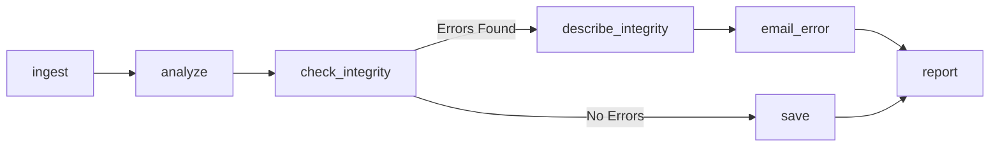

# Airflow

- ApacheAirflow는 워크플로우 오픈소스 플랫폼이다.
- python으로 워크플로우를 작성하고 스케쥴링, 모니터링하는 플랫폼이다.
- 스케쥴링하고 모니터링을 코드로 작성하기에 더 세분화할 수 있고, 더 정교화한 파이프라인을 구성할 수 있다.
- 예약된 워크플로우를 트리거하고 실행할 실행기에 TASK를 제출하는 두 가지 모두 처리하는 스케쥴러다.

## 작동 원리
### 1. KeyConcept
1. DAG(Directed Acyclic Graph)
     - 단어 뜻 그대로 DAG라고 부른다.
     - 반복이나 순환을 허용하지 않는다.
     - 순차적으로 작업이 이뤄지며, 순환 실행을 방지하기 때문에 중요함(논리적 오류 ==> Deadlock)

2. Operator
    - Operator(Task)를 정의하는데 사용
    - Operator Type
      - ActionOperators
        - 기능이나 명령을 실행하는 오퍼레이터
        - 실제 연산을 수행, 데이터 추출 및 프로세싱
        - 기본 Operators는 BashOperator, PythonOperator, EmailOperator가 있다.
      - TransferOperator
        - 하나의 시스템을 다른 시스템으로 옮긴다.(source -> destination)
        - presto에서 MySQL로 데이터를 전송하는데 사용
      - SensorOperators
        - 조건이 만족할 때까지 기다렸다가, 조건이 충족되면 다음 Task를 실행

3. Task & Task Instance
    - Task : 데이터 파이프라인에 존재하는 Operator를 의미
      - Operator를 실행하면 Task가 된다.
    - Task Instance
      - 데이터 파이프라인이 trigger되어 실행될 떄 생성된 Task를 TaskInstance라고 한다.
      - 태스크 실행 순서 ( binary right shift operator 를 사용하여 태스크의 의존성을 정의 )
        - Task1 >> Task2 >> Task3
        - [Task1, Task2] >> Task3

### 2. Airflow component

- 웹서버 : 웹 대시보드로 스케쥴러에서 분석한 DAG를 시각화하고 실행 결과를 확인할 수 있는 인터페이스를 제공
- 스케쥴러 : DAG를 분석하고 현재 시점에서 DAG의 스케쥴이 지난 경우 Airflow worker의 DAG의 태스크를 예약함
- Worker : 예약된 태스크를 실제로 실행시키는 것
- Metastore : 에어플로우에 있는 DAG, TASK등 메타데이터 관리
- Executor : 태스크가 어떻게 실행되는지 정의

### 3. 장단점
#### 1.장점
- 파이썬 코드를 이용해서 파이프라인을 구현하므로 파이썬에서 구현할 수 있는 대부분의 방법을 사용해서 커스텀할 수 있다. (확장이 용이)
- 데이터 인프라 관리, DW 구축, 머신러닝/분석/실험 데이터 환경 구성이 유용함
- 에어플로 스케쥴링 기능으로 DAG에 정의된 특정 시점에 트리거할 수 있을 뿐만 아니라 최종 시점과 예상되는 다음 스케쥴 주기를 상세하게 알려준다.
- Backfill(재처리 작업)을 사용하면 과거 데이터를 손쉽게 재처리할 수 있기에 코드를 변경 후 재생성이 필요한 데이터 재처리가 가능하다.

#### 2. 단점
- 파이썬 의존적
- 작은 환경 변화에도 작동 오류가 나는 경우가 있음

### 4. 주의사항
- DataStreamingSolution 적용하기에는 적합하지 않음
  - 초단위 데이터 처리가 필요한 경우 부적합
  - 반복적이거나 배치 태스크를 실행하는 기능에 초점이 맞춰져 있음
- DataProcessingFramework( Flink, Spark, Hadoop)로 사용하는 것이 부적절
  - 데이터 프로세싱 작업에 최적화되어 있지 않아서 매우 느림
  - 경우에 따라 메모리 부족으로 작업이 진행되지 않을 수 있음
- 파이프라인 규모가 커지면 파이썬 코드가 굉장히 복잡해질 수 있음